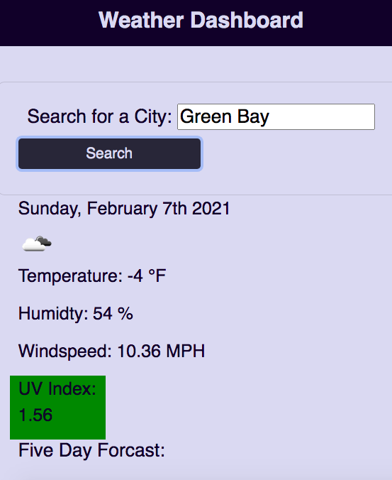
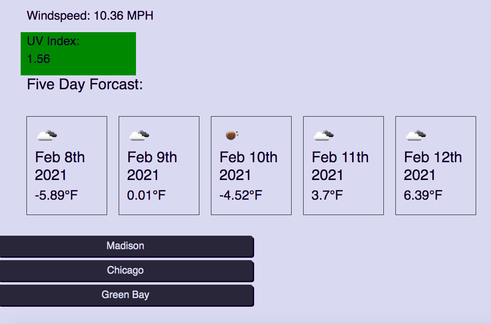

# Weather Dashboard

Weather aplication using OpenWeather API along with moment.js to display current local weather, temperature, humidity, wind speed and UV index. While also displaying the weather for the next five days featuring a weather icon.

## Technologies

* HTML
* CSS
* JavaScript
* moment.js

## Deployment

Link to [Weather Dashboard](https://rachel-reidenga.github.io/portfolio/)

Link to code on [GitHub](https://github.com/Rachel-Reidenga/portfolio/blob/Rachel-Reidenga.github.io/index.html)

Link to repository on [GitHub](https://github.com/Rachel-Reidenga/portfolio)

## Screenshots

## Built With

Shout out to Tanetta J, Monica H and Paul C

## Acknowledgments

[css-tricks.com](https://css-tricks.com/)

[w3schools.com](https://www.w3schools.com/)

[stackoverflow](https://stackoverflow.com/)
